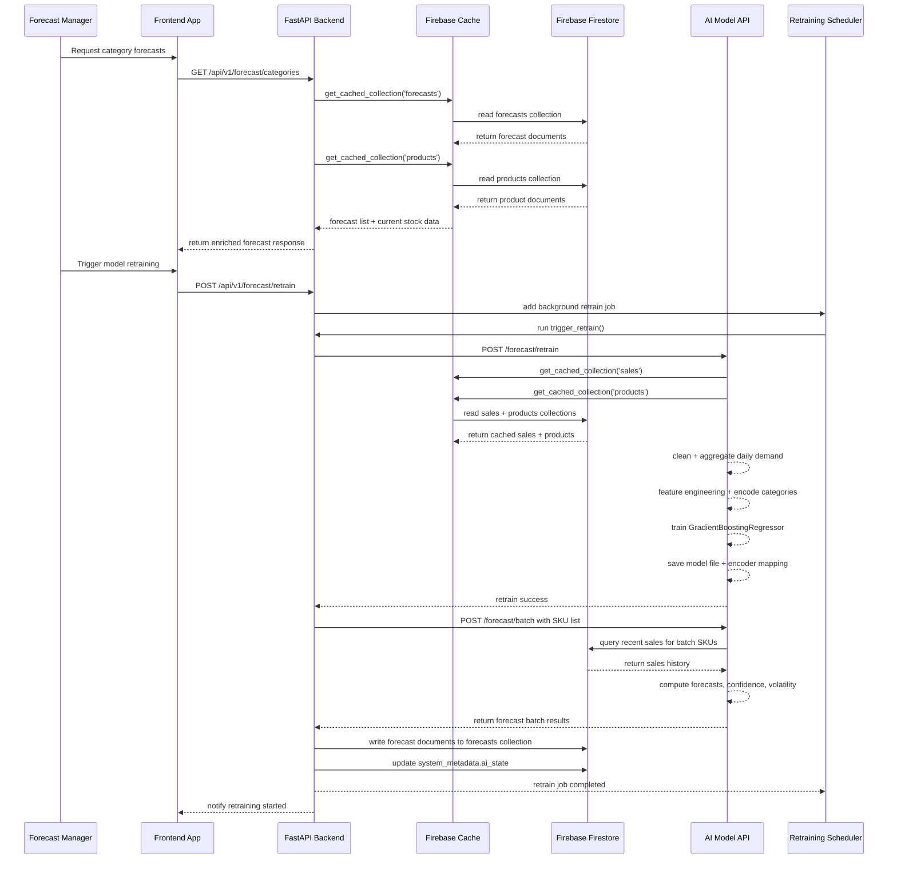

# AI Forecasting Workflow Sequence Diagram

```mermaid
sequenceDiagram
    participant Manager as Forecast Manager
    participant Frontend as Frontend App
    participant Backend as FastAPI Backend
    participant Cache as Firebase Cache
    participant Firestore as Firebase Firestore
    participant AIModel as AI Model API
    participant Scheduler as Retraining Scheduler

    Manager->>Frontend: Request category forecasts
    Frontend->>Backend: GET /api/v1/forecast/categories
    Backend->>Cache: get_cached_collection('forecasts')
    Cache->>Firestore: read forecasts collection
    Firestore-->>Cache: return forecast documents
    Backend->>Cache: get_cached_collection('products')
    Cache->>Firestore: read products collection
    Firestore-->>Cache: return product documents
    Cache-->>Backend: forecast list + current stock data
    Backend-->>Frontend: return enriched forecast response

    Manager->>Frontend: Trigger model retraining
    Frontend->>Backend: POST /api/v1/forecast/retrain
    Backend->>Scheduler: add background retrain job
    Scheduler->>Backend: run trigger_retrain()
    Backend->>AIModel: POST /forecast/retrain
    AIModel->>Cache: get_cached_collection('sales')
    AIModel->>Cache: get_cached_collection('products')
    Cache->>Firestore: read sales + products collections
    Firestore-->>Cache: return cached sales + products
    AIModel-->>AIModel: clean + aggregate daily demand
    AIModel-->>AIModel: feature engineering + encode categories
    AIModel-->>AIModel: train GradientBoostingRegressor
    AIModel-->>AIModel: save model file + encoder mapping
    AIModel-->>Backend: retrain success

    Backend->>AIModel: POST /forecast/batch with SKU list
    AIModel->>Firestore: query recent sales for batch SKUs
    Firestore-->>AIModel: return sales history
    AIModel-->>AIModel: compute forecasts, confidence, volatility
    AIModel-->>Backend: return forecast batch results
    Backend->>Firestore: write forecast documents to forecasts collection
    Backend->>Firestore: update system_metadata.ai_state
    Backend-->>Scheduler: retrain job completed
    Backend-->>Frontend: notify retraining started
```