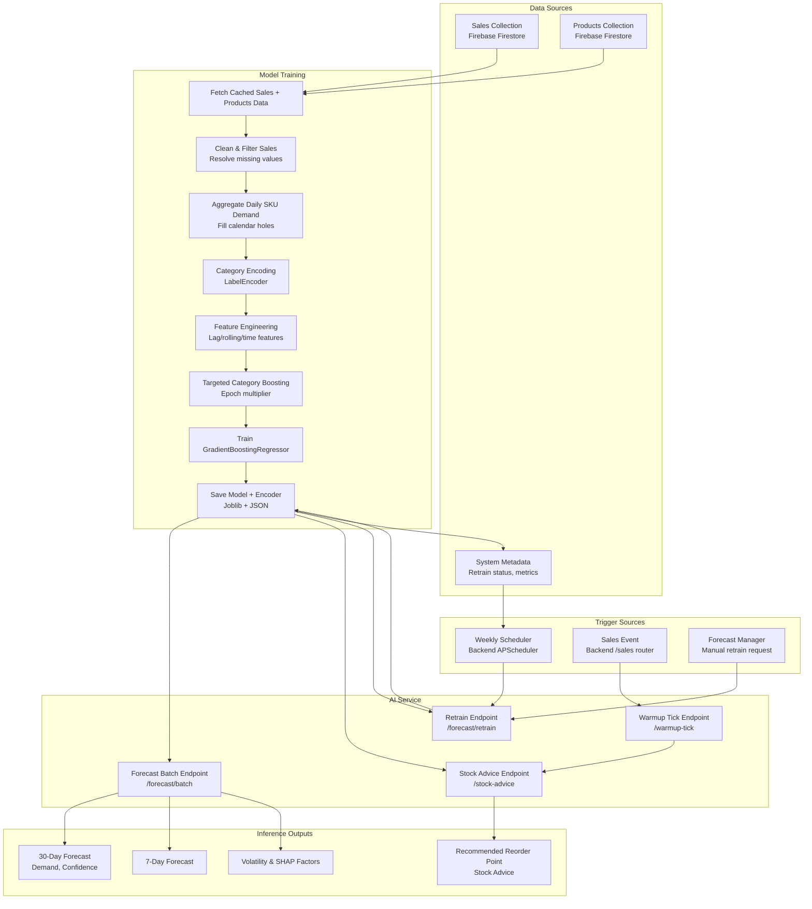

# Completed AI Workflow Diagram

```mermaid
flowchart TD
    subgraph "Data Sources"
        Sales[Sales Collection<br/>Firebase Firestore]
        Products[Products Collection<br/>Firebase Firestore]
        SystemMeta[System Metadata<br/>Retrain status, metrics]
    end

    subgraph "Model Training"
        FetchData[Fetch Cached Sales + Products Data]
        CleanData[Clean & Filter Sales<br/>Resolve missing values]
        Aggregate[Aggregate Daily SKU Demand<br/>Fill calendar holes]
        Encode[Category Encoding<br/>LabelEncoder]
        FeatureEng[Feature Engineering<br/>Lag/rolling/time features]
        Boost[Targeted Category Boosting<br/>Epoch multiplier]
        Train[Train GradientBoostingRegressor]
        SaveModel[Save Model + Encoder<br/>Joblib + JSON]
    end

    subgraph "AI Service"
        Batch[Forecast Batch Endpoint<br/>/forecast/batch]
        StockAdvice[Stock Advice Endpoint<br/>/stock-advice]
        Warmup[Warmup Tick Endpoint<br/>/warmup-tick]
        Retrain[Retrain Endpoint<br/>/forecast/retrain]
    end

    subgraph "Inference Outputs"
        Forecast30[30-Day Forecast<br/>Demand, Confidence]
        Forecast7[7-Day Forecast]
        ForecastMeta[Volatility & SHAP Factors]
        StockRec[Recommended Reorder Point<br/>Stock Advice]
    end

    subgraph "Trigger Sources"
        Scheduler[Weekly Scheduler<br/>Backend APScheduler]
        SalesEvent[Sales Event<br/>Backend /sales router]
        Analyst[Forecast Manager<br/>Manual retrain request]
    end

    Sales --> FetchData
    Products --> FetchData
    FetchData --> CleanData
    CleanData --> Aggregate
    Aggregate --> Encode
    Encode --> FeatureEng
    FeatureEng --> Boost
    Boost --> Train
    Train --> SaveModel
    SaveModel --> Batch
    SaveModel --> StockAdvice
    SaveModel --> Retrain

    Batch --> Forecast30
    Batch --> Forecast7
    Batch --> ForecastMeta
    StockAdvice --> StockRec
    Warmup --> StockAdvice

    Scheduler --> Retrain
    Analyst --> Retrain
    SalesEvent --> Warmup
    Retrain --> SaveModel
    SaveModel --> SystemMeta
    SystemMeta --> Scheduler
```