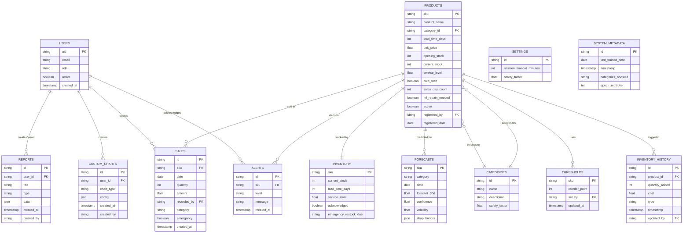

# Completed Entity-Relationship Diagram

```mermaid
erDiagram
    USERS ||--o{ REPORTS : "creates/views"
    USERS ||--o{ CUSTOM_CHARTS : "creates"
    USERS ||--o{ SALES : "records"
    USERS ||--o{ ALERTS : "acknowledges"

    PRODUCTS ||--o{ SALES : "sold in"
    PRODUCTS ||--|| INVENTORY : "tracked by"
    PRODUCTS ||--o{ FORECASTS : "predicted for"
    PRODUCTS }o--|| CATEGORIES : "belongs to"
    PRODUCTS ||--o{ THRESHOLDS : "uses"
    PRODUCTS ||--o{ INVENTORY_HISTORY : "logged in"
    PRODUCTS ||--o{ ALERTS : "alerts for"

    CATEGORIES ||--o{ PRODUCTS : "categorizes"

    USERS {
        string uid PK
        string email
        string role
        boolean active
        timestamp created_at
    }

    PRODUCTS {
        string sku PK
        string product_name
        string category_id FK
        int lead_time_days
        float unit_price
        int opening_stock
        int current_stock
        float service_level
        boolean cold_start
        int sales_day_count
        boolean ml_retrain_needed
        boolean active
        string registered_by FK
        date registered_date
    }

    CATEGORIES {
        string id PK
        string name
        string description
        float safety_factor
    }

    SALES {
        string id PK
        string sku FK
        date date
        int quantity
        float amount
        string recorded_by FK
        string category
        boolean emergency
        timestamp created_at
    }

    INVENTORY {
        string sku PK
        int current_stock
        int lead_time_days
        float service_level
        boolean acknowledged
        string emergency_restock_due
    }

    FORECASTS {
        string sku PK
        string category
        date date
        float forecast_30d
        float confidence
        float volatility
        json shap_factors
    }

    REPORTS {
        string id PK
        string user_id FK
        string title
        string type
        json data
        timestamp created_at
        string created_by
    }

    CUSTOM_CHARTS {
        string id PK
        string user_id FK
        string chart_type
        json config
        timestamp created_at
        string created_by
    }

    THRESHOLDS {
        string sku PK
        int reorder_point
        string set_by FK
        timestamp updated_at
    }

    INVENTORY_HISTORY {
        string id PK
        string product_id FK
        int quantity_added
        float cost
        string type
        timestamp timestamp
        string updated_by FK
    }

    ALERTS {
        string id PK
        string sku FK
        string level
        string message
        timestamp created_at
    }

    SETTINGS {
        string id PK
        int session_timeout_minutes
        float safety_factor
    }

    SYSTEM_METADATA {
        string id PK
        date last_trained_date
        timestamp timestamp
        string categories_boosted
        int epoch_multiplier
    }
```