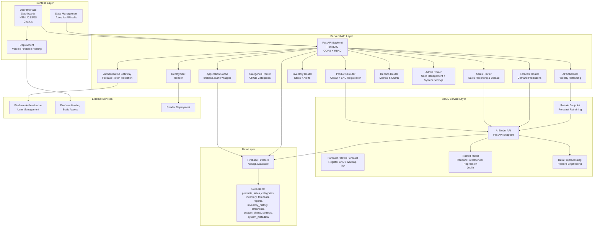

# Updated System Architecture Diagram

```mermaid
graph TB
    subgraph "Frontend Layer"
        UI[User Interface<br/>Dashboards<br/>HTML/CSS/JS<br/>Chart.js]
        State[State Management<br/>Axios for API calls]
        DeployFE[Deployment<br/>Vercel / Firebase Hosting]
    end
    
    subgraph "Backend API Layer"
        API[FastAPI Backend<br/>Port 8000<br/>CORS + RBAC]
        Auth[Authentication Gateway<br/>Firebase Token Validation]
        Cache[Application Cache<br/>firebase.cache wrapper]
        Products[Products Router<br/>CRUD + SKU Registration]
        Categories[Categories Router<br/>CRUD Categories]
        Sales[Sales Router<br/>Sales Recording & Upload]
        Inventory[Inventory Router<br/>Stock + Alerts]
        Forecast[Forecast Router<br/>Demand Predictions]
        Reports[Reports Router<br/>Metrics & Charts]
        Admin[Admin Router<br/>User Management + System Settings]
        Scheduler[APScheduler<br/>Weekly Retraining]
        DeployBE[Deployment<br/>Render]
    end
    
    subgraph "AI/ML Service Layer"
        AIAPI[AI Model API<br/>FastAPI Endpoint]
        ForecastEndpoint[Forecast / Batch Forecast<br/>Register SKU / Warmup Tick]
        RetrainService[Retrain Endpoint<br/>Forecast Retraining]
        Model[Trained Model<br/>Random Forest/Linear Regression<br/>Joblib]
        Preprocessing[Data Preprocessing<br/>Feature Engineering]
    end
    
    subgraph "Data Layer"
        Firestore[Firebase Firestore<br/>NoSQL Database]
        Collections[Collections:<br/>products, sales, categories,<br/>inventory, forecasts, reports,<br/>inventory_history, thresholds,<br/>custom_charts, settings,<br/>system_metadata]
    end
    
    subgraph "External Services"
        FirebaseAuth[Firebase Authentication<br/>User Management]
        FirebaseHosting[Firebase Hosting<br/>Static Assets]
        Render[Render Deployment]
    end
    
    UI --> API
    State --> API
    API --> Auth
    API --> Cache
    API --> Products
    API --> Sales
    API --> Inventory
    API --> Forecast
    API --> Reports
    API --> Admin
    API --> Scheduler
    
    Products --> AIAPI
    Sales --> AIAPI
    Forecast --> AIAPI
    Scheduler --> RetrainService
    RetrainService --> AIAPI
    AIAPI --> Model
    AIAPI --> Preprocessing
    AIAPI --> Firestore
    Cache --> Firestore
    API --> Firestore
    
    Auth --> FirebaseAuth
    DeployFE --> FirebaseHosting
    DeployBE --> Render
    UI --> DeployFE
    API --> DeployBE
    Firestore --> Collections
```