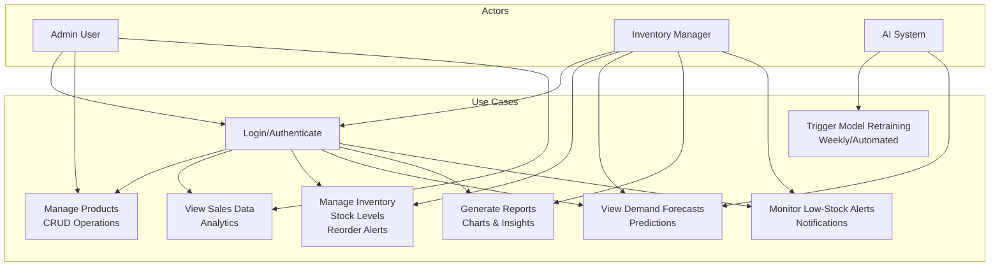

# Updated Use Case Diagram

```mermaid
graph TD
    subgraph "Actors"
        Admin[Admin User]
        Manager[Inventory Manager]
        AI[AI System]
    end
    
    subgraph "Use Cases"
        Login[Login/Authenticate]
        ManageProducts[Manage Products<br/>CRUD Operations]
        ViewSales[View Sales Data<br/>Analytics]
        ManageInventory[Manage Inventory<br/>Stock Levels<br/>Reorder Alerts]
        ViewForecasts[View Demand Forecasts<br/>Predictions]
        GenerateReports[Generate Reports<br/>Charts & Insights]
        RetrainModel[Trigger Model Retraining<br/>Weekly/Automated]
        MonitorAlerts[Monitor Low-Stock Alerts<br/>Notifications]
    end
    
    Admin --> Login
    Manager --> Login
    Admin --> ManageProducts
    Admin --> ViewSales
    Manager --> ManageInventory
    Manager --> ViewForecasts
    Manager --> GenerateReports
    Manager --> MonitorAlerts
    AI --> RetrainModel
    AI --> ViewForecasts
    
    Login --> ManageProducts
    Login --> ViewSales
    Login --> ManageInventory
    Login --> ViewForecasts
    Login --> GenerateReports
    Login --> MonitorAlerts
```